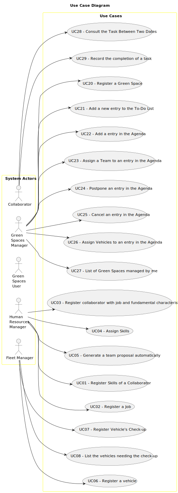

# Use Case Diagram (UCD)

**In the scope of this project, there is a direct relationship of _1 to 1_ between Use Cases (UC) and User Stories (US).**

However, be aware, this is a pedagogical simplification. On further projects and course units there may also exist _1 to N **and/or** N to 1_ relationships between UC and US.

**Insert below the Use Case Diagram in a SVG format**

**For each UC/US, it must be provided evidences of applying main activities of the software development process (requirements, analysis, design, tests and code). Gather those evidences on a separate file for each UC/US and set up a link as suggested below.**

# Use Cases / User Stories

| UC/US | Description                                                                             |                   
|:------|:----------------------------------------------------------------------------------------|
| US001 | [Register Skills of a Collaborator](../../us001/Readme.md)                              |
| US002 | [Register a Job](../../us002/Readme.md)                                                 |
| US003 | [Register collaborator with job and fundamental characteristics](../../us003/Readme.md) |
| US004 | [Assign Skills](../../us004/Readme.md)                                                  |
| US005 | [Generate a team proposal automatically ](../../us005/Readme.md)                        |
| US006 | [Register a vehicle](../../us006/Readme.md)                                             |
| US007 | [Register Vehicle's Check-up](../../us007/Readme.md)                                    |
| US008 | [List the vehicles needing the check-up](../../us008/Readme.md)                         |
| US020 | [Register a Green Space](../../us020/Readme.md)                                         |
| US021 | [Add a new entry to the To-Do List](../../us021/Readme.md)                              |
| US022 | [Add a entry in the Agenda](../../us022/Readme.md)                                      |
| US023 | [Assign a Team to an entry in the Agenda](../../us023/Readme.md)                        |
| US024 | [Postpone an entry in the Agenda](../../us024/Readme.md)                                |
| US025 | [Cancel an entry in the Agenda](../../us025/Readme.md)                                  |
| US026 | [Assign Vehicles to an entry in the Agenda](../../us026/Readme.md)                      |
| US027 | [List of green spaces managed by me](../../us027/Readme.md)                             |
| US028 | [Consult the Task Between Two Dates](../../us028/Readme.md)                             |
| US029 | [Record the completion of a task](../../us029/Readme.md)                                |

