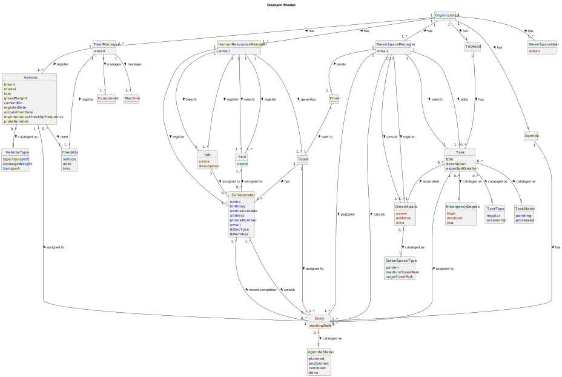

# OO Analysis

The construction process of the domain model is based on the client specifications, especially the nouns (for _concepts_) and verbs (for _relations_) used.

## Rationale to identify domain conceptual classes
To identify domain conceptual classes, start by making a list of candidate conceptual classes inspired by the list of categories suggested in the book "Applying UML and Patterns: An Introduction to Object-Oriented Analysis and Design and Iterative Development".

### _Conceptual Class Category List_

**Business Transactions**

* Task
* Team
* CheckUp
* Job
* Skill

---

**Transaction Line Itemss**

* Agenda

---

**Product/Service related to a Transaction or Transaction Line Item**

* Equipment
* Machine
* Vehicle

---

**Transaction Records**

* n/a

---  

**Roles of People or Organizations**

* Collaborator
* FleetManager
* HumanResourcesManager
* GreenSpacesManager 
* GreenSpacesUser

---

**Places**

* Organization
* GreenSpace
* Garden
* MediumSizedPark
* LargeSizedPark

---

**Noteworthy Events**

* Task

---

**Physical Objects**

* Equipment
* Machine
* Vehicle

---

**Descriptions of Things**

* Skill
* Job

---

**Catalogs**

* Vehicle
* Equipment
* Machine
* Job
* Skill

---

**Containers**

* Team
* Agenda
* CheckUp
* TypeVehicle

---

**Elements of Containers**

* Collaborator
* Task
* Vehicle

---

**Organizations**

* Organization

---

**Other External/Collaborating Systems**

* UserPortal

---

**Records of finance, work, contracts, legal matters**

* n/a

---

**Financial Instruments**

* n/a

---

**Documents mentioned/used to perform some work/**

* n/a

---

## Rationale to identify associations between conceptual classes

An association is a relationship between instances of objects that indicates a relevant connection and that is worth of remembering, or it is derivable from the List of Common Associations:

- **_Collaborator_** has **_Skill_**
- **_Collaborator_** has **_Job_**
- **_FleetManager_** register **_Vehicle_**
- **_FleetManager_** creates **_CheckUp_**
- **_FleetManager_** manages **_Machine_**
- **_FleetManager_** manages **_Equipment_**
- **_Garden_** is a **_GreenSpace_**
- **_HumanResourcesManager_** register **_Collaborator_**
- **_HumanResourcesManager_** register **_Skill_**
- **_HumanResourcesManager_** selects **_Job_**
- **_HumanResourcesManager_** register **_Job_**
- **_HumanResourcesManager_** selects **_Skill_**
- **_HumanResourcesManager_** generates **_Team_**
- **_Job_** assigned to **_Collaborator_**
- **_LargeSizedPark_** is a **_GreenSpace_**
- **_MediumSizedPark_** is a **_GreenSpace_**
- **_Organization_** manages **_GreenSpace_**
- **_Organization_** has **_GreenSpaceManager_**
- **_Organization_** has **_GreenSpaceUser_**
- **_Organization_** has **_HumanResourcesManager_**
- **_Organization_** has **_FleetManager_**
- **_Organization_** has **_Task_**
- **_Skill_** assigned to **_Collaborator_**
- **_Task_** need **_Skill_**
- **_Task_** assigned to **_Team_**
- **_Team_** has **_Collaborator_**
- **_Vehicle_** cataloged as **_TypeVehicle_**
- **_Vehicle_** need **_CheckUp_**

| Concept (A) 		        | Association   	 |           Concept (B) |
|-----------------------|:---------------:|----------------------:|
| Collaborator          |       has       |                 Skill |
| Collaborator          |       has       |                   Job |
| FleetManager          |    register     |               Vehicle |
| FleetManager          |     creates     |               CheckUp |
| FleetManager          |     manages     |               Machine |
| FleetManager          |     manages     |             Equipment |
| Garden                |       is        |            GreenSpace |
| HumanResourcesManager |    register     |          Collaborator |
| HumanResourcesManager |    register     |                 Skill |
| HumanResourcesManager |     selects     |                   Job |
| HumanResourcesManager |    register     |                   Job |
| HumanResourcesManager |     selects     |                 Skill |
| HumanResourcesManager |    generates    |                  Team |
| Job                   |   assigned to   |          Collaborator |
| LargeSizedPark        |      is a       |            GreenSpace |
| MediumSizedPark       |      is a       |            GreenSpace |
| Organization          |     manages     |            GreenSpace |
| Organization          |       has       |                  Task |
| Organization          |       has       |          FleetManager |
| Organization          |       has       | HumanResourcesManager |
| Organization          |       has       |     GreenSpaceManager |
| Organization          |       has       |        GreenSpaceUser |
| Skill                 |   assigned to   |          Collaborator |
| Task                  |      need       |                 Skill |
| Task                  |   assigned to   |                  Team |
| Team                  |       has       |          Collaborator |
| Vehicle               |  cataloged as   |           TypeVehicle |
| Vehicle               |      need       |               CheckUp |

## Domain Model

**Do NOT forget to identify concept atributes too.**

**Insert below the Domain Model Diagram in a SVG format**

