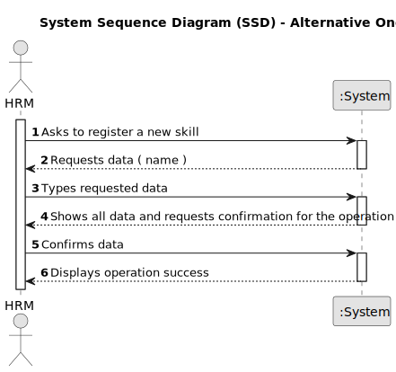

# US01 - Register Skills of a Collaborator

## 1. Requirements Engineering

### 1.1. User Story Description

As a Human Resources Manager (HRM), I want to register skills that a
collaborator may have.

### 1.2. Customer Specifications and Clarifications 

**From the specifications document:**

> The HRM is tasked with the job of registering the various skills a collaborator may have.
> 
> Among others, these are some skills a collaborator should have to work in green spaces: horticulture knowledge, landscaping design, plant care, and equipment operation.
> 
> The system is integrated with an interface dedicated to helping the HRM manage these skills effectively.
> 
> The HRM can view the list of skills with their information and can also edit, add, and even remove skills.
 
**From the client clarifications:**

> **Question:** What guidelines are used in the creation of a skill?
>
> **Answer:** Only the name of the skill.

> **Question:** Is it possible to create a skill that already exists in the system ?
>
> **Answer:** No. By definition, it is not possible to have duplicated skills in the system.

>
> **Question:** Must I manually input skills, or is there an option to upload a file containing all the skills?
> 
> **Answer:** Both methods are permissible, as they serve the same purpose. However, the key distinction lies in the user experience (UX).

> 
> **Question:** Is it necessary for the HRM to view confirmation of both the success of the operation and the added skills, or only the success of the operation?
> 
> **Answer:** The requirement may vary depending on whether you choose to insert a single skill or a batch of skills. Some adjustments may be necessary accordingly.

> 
> **Question:** Are there any other potential outcomes, such as if the HRM fails to enter the requested data, should the system prompt the user to register a different competency?
> 
> **Answer:** At the moment, a skill consists solely of a name.

### 1.3. Acceptance Criteria

* **AC1:** The name is mandatory when creating a skill.
* **AC2:** The name must not have special characters or algarisms.
* **AC3:** Duplicated skills are not allowed.
* **AC4:** The system must guarantee that only HR Managers with proper authorization can create, remove, or edit skills.

### 1.4. Found out Dependencies

* There is a dependency on "US02 - Register a Job" - Before registering a job, it's crucial to have a precise comprehension of the skills necessary for that position.
* There is a dependency on "US04 - Assign Skills to a Collaborator" - To assign skills to a collaborator, predefined skills must already be in place.

### 1.5 Input and Output Data

**Input Data:**

* Typed data:
    * Skill name
    * Skill category
	
* Selected data:
    * None

**Output Data:**

* List of existing skills
* Success of the operation
* Error messages

### 1.6. System Sequence Diagram (SSD)

**_Other alternatives might exist._**

#### Alternative One

### 1.7 Other Relevant Remarks

* n/a