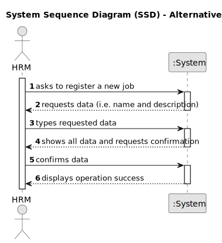
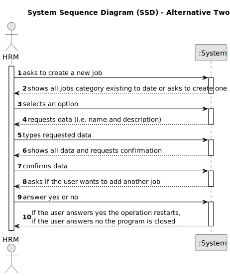

# US002 - Register a Job

## 1. Requirements Engineering

### 1.1. User Story Description

As an HRM, I want to register a job that a collaborator need to have.
### 1.2. Customer Specifications and Clarifications 

**From the specifications document:**

>	Each job must have just one unique name. 

>	The system can't accept duplicates.

**From the client clarifications:**

> **Question:** Is it necessary to associate a category with the inserted works? 
>
> **Answer:** it is not necessary as there are no US's that suggest that this might be necessary;

> **Question:** What are the input data for register a job?
>
> **Answer:** Just the name of the job.

### 1.3. Acceptance Criteria

* **AC1:** The user is not allowed to enter duplicate jobs, otherwise  the system must print an error message.
* **AC2:** If the user input a wrong username and/or password, the system will print an error message. 
* **AC3:** A job name can’t have special characters or digits.

### 1.4. Found out Dependencies

* No dependencies.

### 1.5 Input and Output Data

**Input Data:**

* Typed data:
    * a name

**Output Data:**

* (In)Success of the operation.

### 1.6. System Sequence Diagram (SSD)

**_Other alternatives might exist._**

#### Alternative One

#### Alternative Two[//]: # ()
<

### 1.7 Other Relevant Remarks

* If the user enters a job that already exists, the system should notify and request that they enter a different profession.