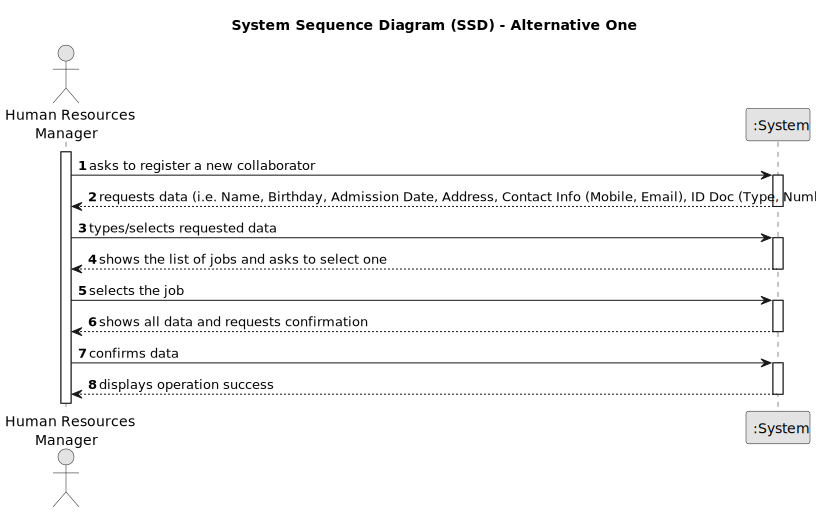

# US003 - Register collaborator with job and fundamental characteristics

## 1. Requirements Engineering

### 1.1. User Story Description

As an HRM, I want to register a collaborator with a job and fundamental characteristics.

### 1.2. Customer Specifications and Clarifications

**From the specifications document:**

>   Human resources manager fills in all fields for collaborator registration.

>	Each collaborator is characterized by having a unique name, a birthday, a date of admission, an adornment, a type of identification document and a number, as well as two contact details (mobile phone and email).

>	The job will be chosen from the list of jobs registered in US02.

**From the client clarifications:**

> **Question:** Does the HRM select the job from a list that we display?
>
> **Answer:** Displaying or not, It's a matter of UX, the dev team should decide about it, but the valid jobs are the ones created within the US02.

> **Question:** Should the system able the HRM to insert multiple collaborators in one interaction before saving them?
>
> **Answer:** It's not required to do so.

> **Question:** 
> - Is there any limitation regarding the length of the name of the collaborator?
> - Should we consider valid only the birthdates in which the collaborator has more than 18 years?
> - What should be the format for the phone number? 9 numbers?
> - What is the format for the numbers from the id doc types?
>
> **Answer:**
> - According to the Portuguese law a name should contain at maximum six words;
> - yes;
> - validating 9 digits will be acceptable; validating with international format would be excelent;
> - each doc type has specific formats like taxpayer number, Citizen Card ou passport.

> **Question:** What is needed for the adress ?  Street, zipcode and a city?
>
> **Answer:** That would be enough.

> **Question:** What should be the accepted format for the emails? Should only specific email services be accepted?
>
> **Answer:**
A valid email address consists of an email prefix and an email domain, both in acceptable formats.
The prefix appears to the left of the @ symbol. The domain appears to the right of the @ symbol.
For example, in the address example@mail.com, "example" is the email prefix, and "mail.com" is the email domain.

### 1.3. Acceptance Criteria

* **AC01:** Full Name, birthdate, admission date, address, contact info (mobile and email), ID doc type and respective number should be provided by HRM.
* **AC02:** All mandatory fields must be filled in.
* **AC03:** Full name can only contain 6 words, consisting only of letters and spaces between each one.
* **AC04:** Birthdate and admission data can only contain numbers and follow the format xx/xx/xxxx
* **AC05:** Birthdate must be 18 years older than the current date.
* **AC06:** Residence must be written including: street, zipcode (must contain numbers and respect the format "xxxx-xxx") and city.
* **AC07:** Phone number must have just 9 numbers.
* **AC08:** The email must contain a prefix to the left of the @ symbol and a domain to its right.
* **AC09:** User will select an identification document type from a list (taxpayer number/citizen card/passport)
* **AC11:** Taxpayer number must contain 9 numbers.
* **AC12:** Citizen Card must contain 8 numbers.
* **AC13:** Passport must contain a letter followed by 6 numbers.
* **AC14:** User will select a job from the list of jobs registered in US02.
* **AC15:** Collaborator must not already have a registered account.
* **AC16:** System must ensure that only HRM registers collaborators.

### 1.4. Found out Dependencies

* There is a dependency on "US002 - Register a Job" as there must be at least one job to assign the employee to be registered.

### 1.5 Input and Output Data

**Input Data:**

* Typed data:
  * Name
  * Birthday
  * Admission Date
  * Address
  * Phone Number
  * Email
  * ID Number

* Selected data:
  * List of ID doc Types
  * List of Jobs

**Output Data:**

* All data of the new registered collaborator
* (In)Success of the operation

### 1.6. System Sequence Diagram (SSD)

**_Other alternatives might exist._**

#### Alternative One

#### Alternative Two

### 1.7 Other Relevant Remarks

* n/a