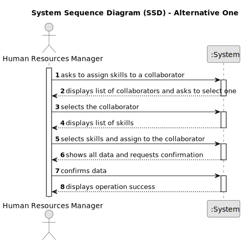

# US004 - Assign Skills 

## 1. Requirements Engineering

### 1.1. User Story Description

As an HRM, I want to assign one or more skills to a collaborator.

### 1.2. Customer Specifications and Clarifications 

**From the specifications document:**

>	Every task is defined by a distinct reference assigned within the organization, accompanied by a designation, both informal and technical descriptions, estimated duration and cost, and a designated task category. 

>	Access to the task is restricted solely to employees of the respective organization until it is published.

**From the client clarifications:**

> **Question:** Can any skill be registered to any collaborator/job? Or should they be associated in categories in association with a specific job
>
> **Answer:** There is no association, it totally depends of the CV of the collaborator.

> **Question:** There is a minimum and maximum number of skills?
>
> **Answer:** No

### 1.3. Acceptance Criteria

* **AC1:** Employee registration is mandatory.
* **AC2:** The system must enable the HRM to choose one or more skills from a predefined list.
* **AC3:** The system must offer a method to update or delete assigned skills as required.
* **AC4:** The system must guarantee that only authorized HR Managers have the authority to assign skills.
* **AC5:** In case of any errors encountered during the skill registration process, the system should present informative error messages to the HR Manager, guiding them on resolving the issue.

### 1.4. Found out Dependencies

* There is a dependency on "US001 - Registering Skills for Collaborators" is required since at least one skill needs to be created.
* There is a dependency on "US003 - Register a collaborator" is necessary to have an employee to add new skills.

### 1.5 Input and Output Data

**Input Data:**
   
* Typed data:
    * Number of skills.
* Selected data:
    * Diferents skills.
    * The employee.

**Output Data:**

* List and confirmation skills.
* List of current employees.
* (In)Success of the operation.

### 1.6. System Sequence Diagram (SSD)

**_Other alternatives might exist._**

