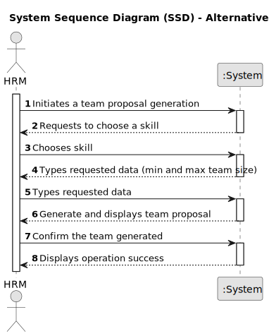

# US05 - Generate a team proposal automatically 

## 1. Requirements Engineering

### 1.1. User Story Description

As a HRM, I want to generate a team proposal automatically.

### 1.2. Customer Specifications and Clarifications 

**From the specifications document:**

>	The team proposal focuses on simplifying and expediting the team formation process, particularly for the HRM. Essentially, it's a tool that helps the HRM put together the right team for a task without all the usual headaches. With this system, the HRM can input the specific skills they need and how many team members they want, and it generates a list of potential candidates.

>   Additionally, there's a user-friendly interface where they can review their selections and confirm the team formation based on their preferences.

**From the client clarifications:**

> **Question:** What is the information necessary for a team proposal?
>
> **Answer:** The costumer provides the max size and the set of skills of the team.

> **Question:** If a team proposal doesn't have enough collaborators, or they don't have the requested skills, should the system send a message?
>
> **Answer:** Yes, the system should provide information of why it can't generate a team.

### 1.3. Acceptance Criteria

* **AC1:** The maximum team size and the set of skills need to be supplied by the HRM.
* **AC2:** Need to have at least 2 collaborators for a team to be generated.
* **AC3:** The system ensures that the team generated meets the exact number of collaborators possessing the required skills specified by the HRM.

### 1.4. Found out Dependencies

* There is a dependency on "US01 - Register skills that a collaborator may have" - to generate a team we need to set a few required skills, as defined in US01.
* There is a dependency on "US04 - Assign one or more skills to a collaborator" - for us to know what skills a collaborator has, we need to assign them first, which is adressed in US04.

### 1.5 Input and Output Data

**Input Data:**

* Typed data:
    * number of collaborators needed
    * maximum team size
    * skills assigned to collaborators
	
* Selected data:
    * skills list 

**Output Data:**

* List of selected collaborators
* Skills possessed by each collaborator
* Confirmation of team formation
* Error messages

### 1.6. System Sequence Diagram (SSD)

**_Other alternatives might exist._**

#### Alternative One

### 1.7 Other Relevant Remarks

* n/a.