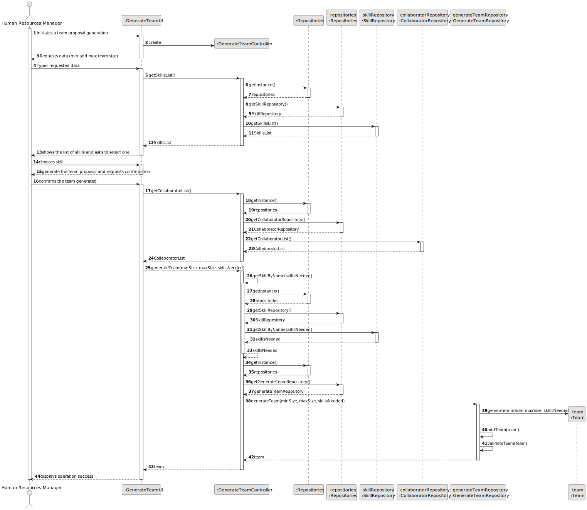
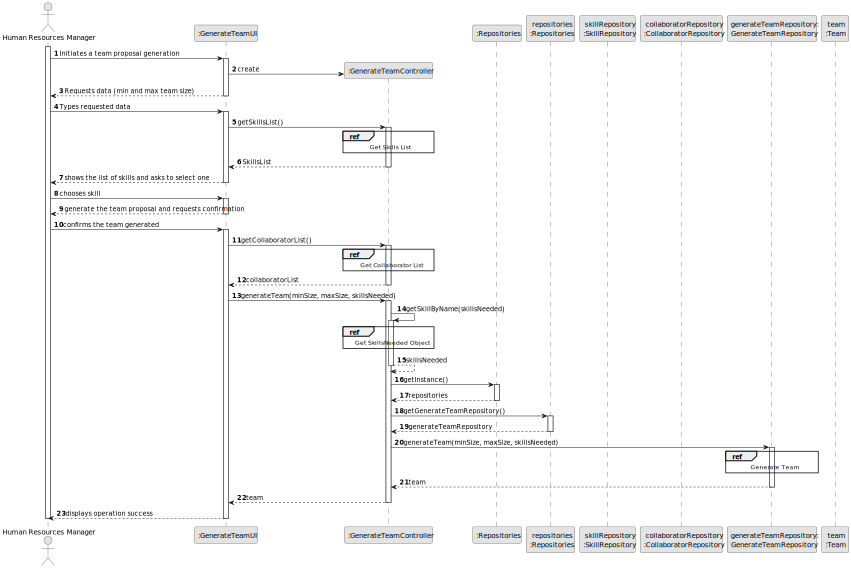
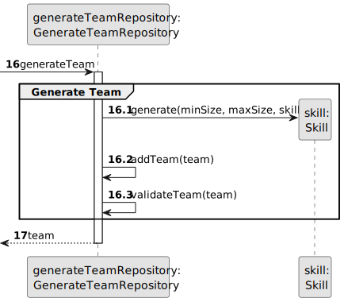
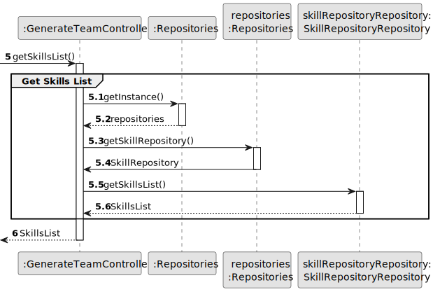
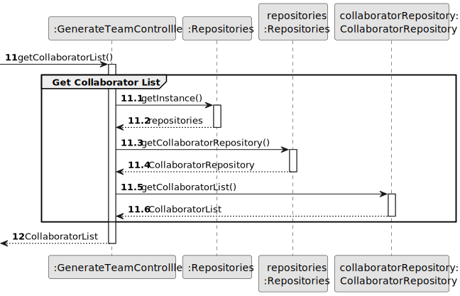
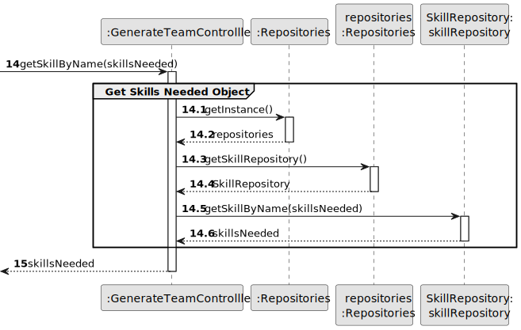
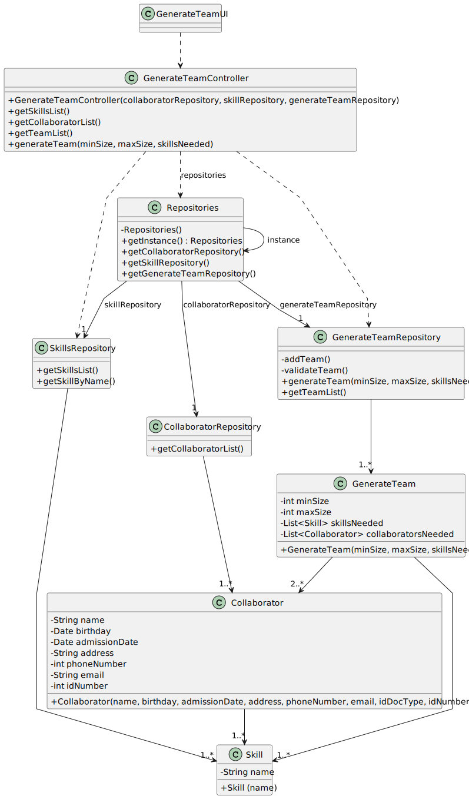

# US005 - Generate a team proposal automatically 

## 3. Design - User Story Realization 

### 3.1. Rationale

_**Note that SSD - Alternative One is adopted.**_

| Interaction ID | Question: Which class is responsible for...   | Answer                 | Justification (with patterns)                                                                                 |
|:---------------|:----------------------------------------------|:-----------------------|:--------------------------------------------------------------------------------------------------------------|
| Step 1  		     | 	... interacting with the actor?              | GenerateTeamUI         | Pure Fabrication: there is no reason to assign this responsibility to any existing class in the Domain Model. |
| 			  		        | 	... coordinating the US?                     | GenerateTeamController | Controller                                                                                                    |
| Step 2  		     | 							                                       |                        |                                                                                                               |
| Step 3  		     | 	...saving the inputted data?                 | Team                   | IE: object created in step 1 has its own data.                                                                |
| Step 4  		     | 							                                       |                        |                                                                                                               |              
| Step 5  		     | 	... validating all data (local validation)?  | Team                   | IE: owns its data.                                                                                            | 
| 			  		        | 	... validating all data (global validation)? | GenerateTeamRepository | IE: knows all teams.                                                                                          | 
| 			  		        | 	... saving the generated team?               | GenerateTeamRepository | IE: owns all teams.                                                                                           | 
| Step 6  		     | 	... informing operation success?             | GenerateTeamUI         | IE: is responsible for user interactions.                                                                     | 

### Systematization ##

According to the taken rationale, the conceptual classes promoted to software classes are: 

* Team

Other software classes (i.e. Pure Fabrication) identified: 

* GenerateTeamUI  
* GenerateTeamController

## 3.2. Sequence Diagram (SD)

_**Note that SSD - Alternative Two is adopted.**_

### Full Diagram

This diagram shows the full sequence of interactions between the classes involved in the realization of this user story.

### Split Diagrams

The following diagram shows the same sequence of interactions between the classes involved in the realization of this user story, but it is split in partial diagrams to better illustrate the interactions between the classes.

It uses Interaction Occurrence (a.k.a. Interaction Use).

**Generate Team**

**Get Skills List**

**Get Collaborator List**

**Get SkillsNeeded Object**

## 3.3. Class Diagram (CD)

