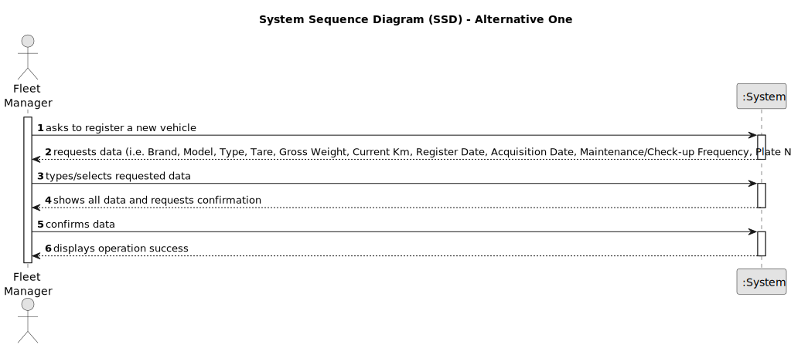

# US006 - Register a vehicle

## 1. Requirements Engineering

### 1.1. User Story Description

As an FM, I wish to register a vehicle including Brand, Model, Type, Tare, Gross Weight, Current Km, Register Date, Acquisition Date, Maintenance/Check-up Frequency (in Kms).

### 1.2. Customer Specifications and Clarifications

**From the specifications document:**

>	Register vehicles in the system is essential to manage the fleet.

>	Fleet manager fills in all the fields for vehicle registration.

>   Each vehicle is characterized by having a brand, model, type, tare, gross weight, current km, registration date, acquisition date, maintenance/check-up frequency and plate.

**From the client clarifications:**

> **Question:** For the application to work does the FM need to fill all the attributes of the vehicle?
>
> **Answer:** Yes, besides the vehicle plate that by mistake doesn`t appear on the text.

> **Question:** Should the application identify a registered vehicle by a serial number or ther attribute?
>
> **Answer:** By plate id.

> **Question:** When a vehicle is registered, are there specific requirements for accepting the brand? For example, does the system need to check if the brand is on a predetermined list? Does this also apply to the model or any other characteristics?
>
> **Answer:** no; one can consider a list os brands and a list of models previsously inserted in the system, no need to go through validations.

### 1.3. Acceptance Criteria

* **AC01:** Brand, Model, Type, Tare, Gross Weight, Current Km, Register Date, Acquisition Date, Maintenance/Check-up Frequency, Plate Number.
* **AC02:** All mandatory fields must be filled in.
* **AC03:** Identity of the registered vehicle must be the plate id.
* **AC04:** Different cars cannot have the same plate id.
* **AC05:** Type of vehicle can be only for passengers or mixed, light or heavy, open box or closed vans or trucks.
* **AC06:** Tare, Gross Weight and Current Km can only contain numbers that are not negative and their respective unit of measurement.
* **AC07:** Register and Acquisition Date can only contain numbers and follow the format xx/xx/xxxx.
* **AC08:** Maintenance/Check-up Frequency must be in Kms.
* **AC09:** Vehicle must not already registered.
* **AC10:** System must ensure that only FM registers vehicles.

### 1.4. Found out Dependencies

* There is no dependencies.

### 1.5 Input and Output Data

**Input Data:**

* Typed data:
  * Brand
  * Model
  * Tare
  * Gross Weight
  * Current Km
  * Register Date
  * Acquisition Date
  * Maintenance/Check-up Frequency
  * Plate Number

* Selected data:
  * Type

**Output Data:**

* All data of the new registered vehicle 
* (In)Success of the operation

### 1.6. System Sequence Diagram (SSD)

**_Other alternatives might exist._**

#### Alternative One

### 1.7 Other Relevant Remarks

* n/a