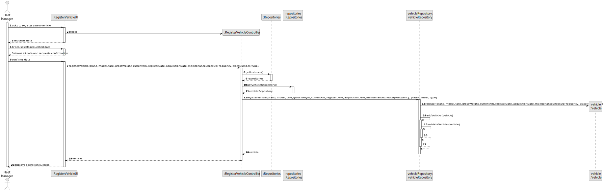
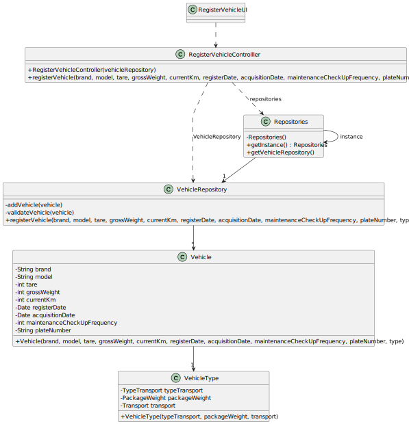

# US006 - Register a vehicle 

## 3. Design - User Story Realization 

### 3.1. Rationale

_**Note that SSD - Alternative One is adopted.**_

| Interaction ID | Question: Which class is responsible for...   | Answer                     | Justification (with patterns)                                                                                                                                     |
|:---------------|:----------------------------------------------|:---------------------------|:------------------------------------------------------------------------------------------------------------------------------------------------------------------|
| Step 1  		     | 	... interacting with the actor?              | RegisterVehicleUI          | Pure Fabrication: there is no reason to assign this responsibility to any existing class in the Domain Model                                                      |
| 		             | 	... coordinating the US?                     | RegisterVehicleControlller | Controller                                                                                                                                                        |
| Step 2 		      | 	                                             |                            |                                                                                                                                                                   |
| Step 3 		      | 	... saving the inputted data?                | Vehicle                    | Information Expert: object created in step 1 has its own data                                                                                                     |
| Step 4 		      | 	                                             |                            |                                                                                                                                                                   |
| Step 5 		      | 	... validating all data (local validation)?  | Vehicle                    | Information Expert: owns its data                                                                                                                                 |
| 		             | 	... validating all data (global validation)? | VehicleRepository          | Information Expert: knows all vehicles                                                                                                                            |
| 		             | 	... saving the registered vehicle?           | VehicleRepository                        | Information Expert: owns all vehicles                                                                                                                             |
| Step 6 		      | 	... informing operation success?             | RegisterVehicleUI     | Information Expert: is responsible for user interactions                                                                                                          | 

### Systematization ##

According to the taken rationale, the conceptual classes promoted to software classes are: 

* Vehicle

Other software classes (i.e. Pure Fabrication) identified: 

* RegisterVehicleUI  
* RegisterVehicleController

## 3.2. Sequence Diagram (SD)

_**Note that SSD - Alternative One is adopted.**_

### Full Diagram

This diagram shows the full sequence of interactions between the classes involved in the realization of this user story.

### Split Diagrams

The following diagram shows the same sequence of interactions between the classes involved in the realization of this user story, but it is split in partial diagrams to better illustrate the interactions between the classes.

It uses Interaction Occurrence (a.k.a. Interaction Use).

**Register Vehicle**

## 3.3. Class Diagram (CD)

