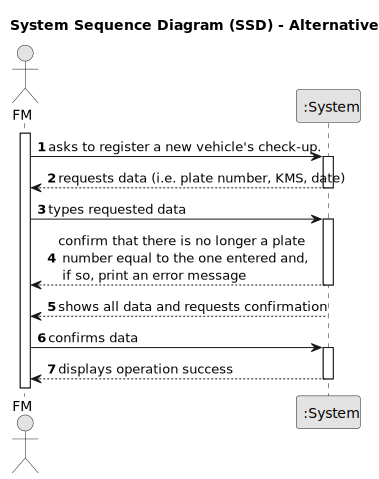
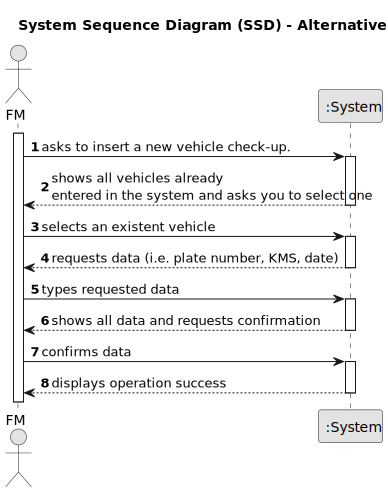

# US007 - Register Vehicle's Check-up.

## 1. Requirements Engineering

### 1.1. User Story Description

As an FM, I wish to register a vehicle’s check-up.

### 1.2. Customer Specifications and Clarifications 

**From the specifications document:**

>	No specifications.

**From the client clarifications:**

> **Question:** Which attributes will you need for the vehicle's check-up?
>
> **Answer:** Plate number, Date, KMS at check-up.

### 1.3. Acceptance Criteria

* **AC1:** All required fields must be filled in.
* **AC2:** The system should only accept units of measurement in kilometers.
* **AC3:** Just the FM manager have the permission to register a new vehicle check-up.
* **AC4:** It's necessary to verify that the car entered by the user exists in the system.
* **AC5:** If the system detects that the car credentials do not exist, it should send an error message stating that the license plate number is incorrect.

### 1.4. Found out Dependencies

* There is a dependency on "US006 - Register a vehicle" as there it's necessary to verify if the car has already been registered before being able to register the check-up.

### 1.5 Input and Output Data

**Input Data:**

* Typed data:
    *  Date
    * KMS at check-up
    * Plate number
	
**Output Data:**

* (In)Success of the operation.

### 1.6. System Sequence Diagram (SSD)

**_Other alternatives might exist._**

#### Alternative One

#### Alternative Two

[//]: # (### 1.7 Other Relevant Remarks)

[//]: # (* The created task stays in a "not published" state in order to distinguish from "published" tasks.)