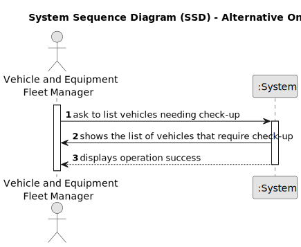

# US008 - Overhauling of vehicles

## 1. Requirements Engineering

### 1.1. User Story Description

As an VFM. I want to list the vehicles needing the check-up.

### 1.2. Customer Specifications and Clarifications 

**From the specifications document:**

>Vehicles are required for executing the tasks assigned to the teams and for transporting machinery and equipment. These vehicles may vary in type, including passenger-only or mixed, light or heavy, vans or lorries with open or closed boxes. All vehicles must undergo inspection, which will occur when they reach the specified number of kilometers according to the check-up frequency.

**From the client clarifications:**

> **Question:** Can the vehicles get placed automatically on a list or the one listing has to be the FM?
>
> **Answer:** The list of vehicles is automatically created but the creation is triggered by the FM.

> **Question:** What information will appear on the final list regarding the vehicle,besides the needing for check-up?
>
> **Answer:** Data that allow to identify the vehicle like Plate, brand and moodle, as well as, the data that allowed to select/insert te vehicle in the list, number of kms, frequecny of checkup and the last checkup.

> **Question:** I'm not sure if I understood everything about US08. In this US we should only list the vehicles that need a check-up (surpass the check-up frequency in KM) or that will shortly need a check-up (5% to the check-up frequency *already said in another post*), correct? If so, the information about the check-up frequency for each vehicle should be asked in US07?
>
> **Answer:** No; the Maintenance/Check-up Frequency (in km) is registered in US06.

### 1.3. Acceptance Criteria

* **AC1:** At least one car must undergo a check-up before presenting this list.
* **AC2:** The list must include all vehicles that have either exceeded the required number of kilometers for inspection or are approaching it (with a difference of less than 5% from the check-up frequency).

### 1.4. Found out Dependencies

* There is a dependency on "US006 - Register a vehicle"  is required as there must be at least one vehicle registered for there to be a list of vehicles in need of a check-up.
* There is a dependency on "US007 - Register a vehicle's overhaul" is necessary as it provides access to the last overhaul, enabling determination of when a specific vehicle should be included in this list. Additionally, it is one of the pieces of information displayed about the vehicle when the list is requested.

### 1.5 Input and Output Data

**Input Data:**

* Typed data:
    * Range of kilometers for overhaul.
    * The number of kilometers remaining before reaching the review limit that FM wants to be informed about.
	
* Selected data:
    * Vehicles category.

**Output Data:**

* List of vehicles needed check-up.
* (In)Success of the operation.

### 1.6. System Sequence Diagram (SSD)

**_Other alternatives might exist._**

