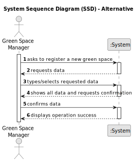

# US020 - Register a Green Space

## 1. Requirements Engineering

### 1.1. User Story Description

As a Green Space Manager (GSM), I want to register a green space (garden, medium-sized park or large-sized park) and its respective area.

### 1.2. Customer Specifications and Clarifications 

**From the specifications document:**

>	The green space must be registered by the GSM.

>   The green spaces must have a type and an area, besides the name and the description.

**From the client clarifications:**

> **Question:** In the registration of a green space, should a green space's name be allowed to contain digits and special characters, or just letters and whitespaces?
>
> **Answer:** Same rules for other names in the business, letters, spaces and dashes.

> **Question:** Good evening, in view of the description of GreenSpaces does it make sense to ask for optional mind for the different types this data?
>
> **Answer:**
In the current version, it is sufficient to define a park using name, size classification, area (hectare) and address.

> **Question:** Can two different green spaces have the same address?
>
> **Answer:** No.

> **Question:** I would like to know between what ranges of hectares a green space is classified as garden, medium or large, or if it is possible to register 2 green spaces with the same area but in different typology, depending on the GSM it registers.
>
> **Answer:** The classification is not automatic, it's up to GSM decide about it.

> **Question:** Can two green spaces have the same name?
>
> **Answer:** No.

> **Question:**  In which unit should the area be measured in?
>
> **Answer:**  Usually, areas are measured in hectares.

### 1.3. Acceptance Criteria

* **AC1:** The green spaces must be a garden, medium-sized park or large-sized park type.
* **AC2:** There cannot exist two green spaces with the same name.

### 1.4. Found out Dependencies

* n/a

### 1.5 Input and Output Data

**Input Data:**

* Typed data:
    * name
    * address
    * area
	
* Selected data:
    * type

**Output Data:**

* All data of the new Green Space
* (In)Success of the operation

### 1.6. System Sequence Diagram (SSD)

**_Other alternatives might exist._**

### 1.7 Other Relevant Remarks

* n/a