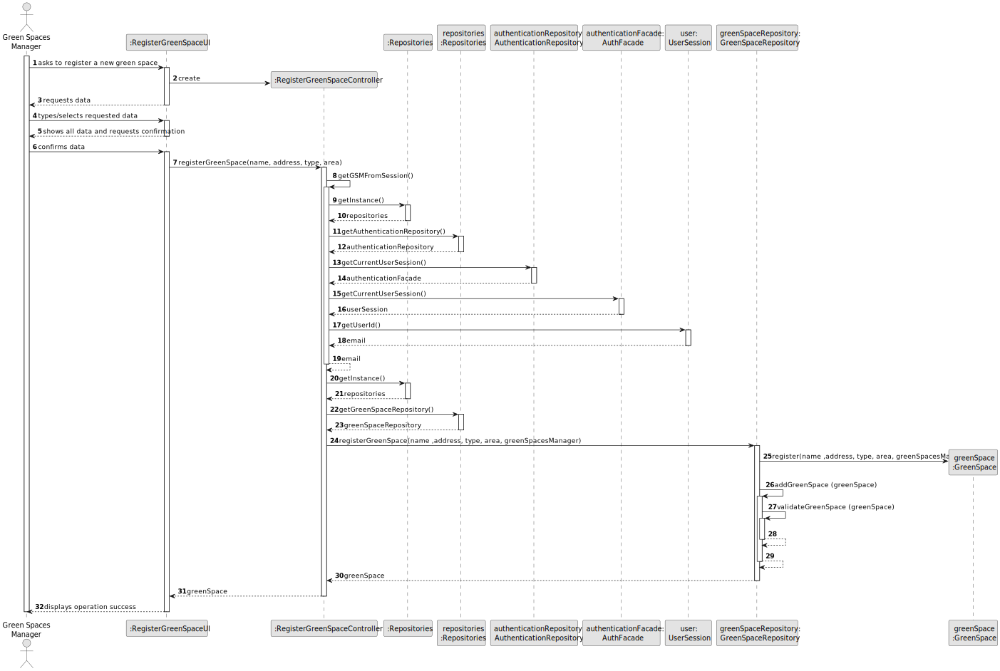
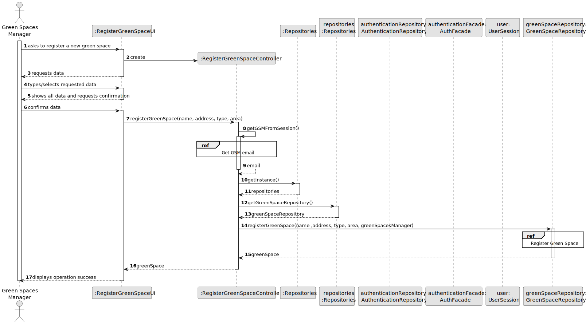
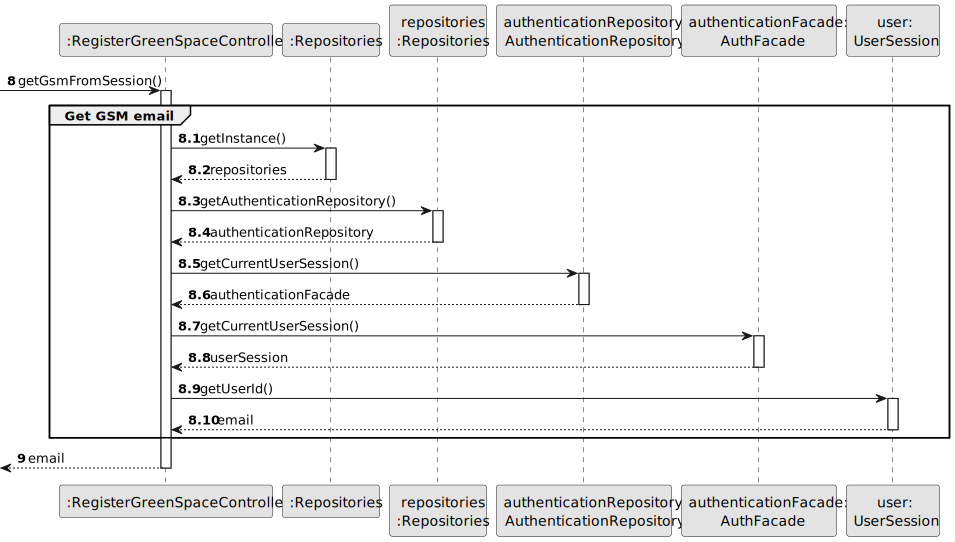
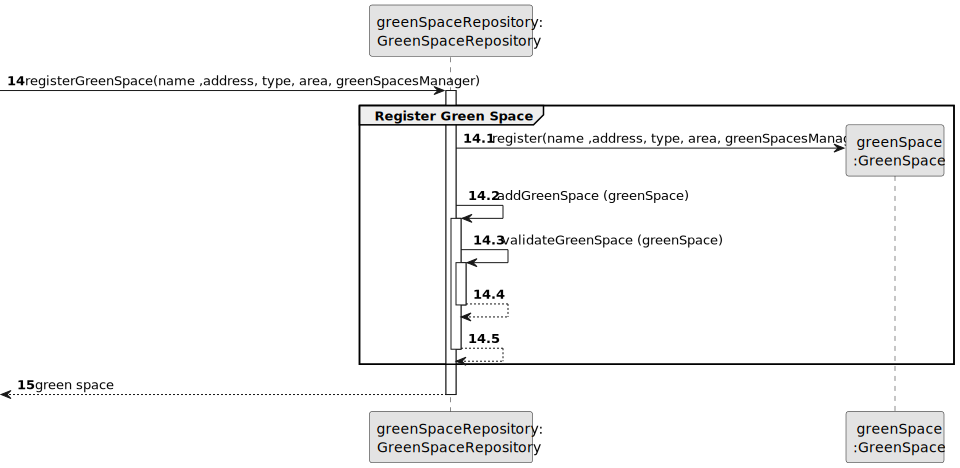
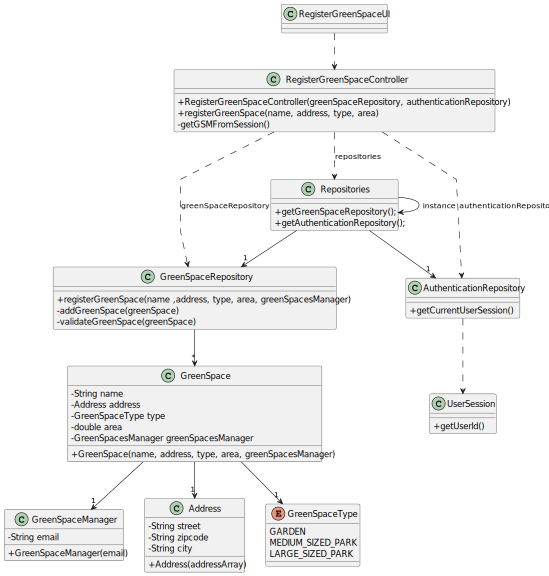

# US020 - Register a Green Space

## 3. Design - User Story Realization 

### 3.1. Rationale

_**Note that SSD - Alternative One is adopted.**_

| Interaction ID | Question: Which class is responsible for...   | Answer                       | Justification (with patterns)                                                                                 |
|:---------------|:----------------------------------------------|:-----------------------------|:--------------------------------------------------------------------------------------------------------------|
| Step 1  		     | 	... interacting with the actor?              | RegisterGreenSpaceUI         | Pure Fabrication: there is no reason to assign this responsibility to any existing class in the Domain Model. |
| 			  		        | 	... coordinating the US?                     | RegisterGreenSpaceController | Controller                                                                                                    |
| 			  		        | ... knowing the user using the system?        | AuthenticationRepository     | IE: cf. A&A component documentation.                                                                          |
| 			  		        | 							                                       | GreenSpaceManager            | IE: knows its own data (e.g. email)                                                                           |
| Step 4  		     | 	... saving the inputted data?                | GreenSpace                   | IE: Object created has its own data.                                                                          |           
| Step 7  		     | 	... validating all data (local validation)?  | GreenSpace                   | IE: owns its data.                                                                                            | 
| 			  		        | 	... validating all data (global validation)? | GreenSpaceRepository         | IE: knows all tasks.                                                                                          | 
| 			  		        | 	... saving the created task?                 | GreenSpaceRepository         | IE: owns all tasks.                                                                                           | 
| Step 8  		     | 	... informing operation success?             | RegisterGreenSpaceUI         | IE: is responsible for user interactions.                                                                     | 

### Systematization ##

According to the taken rationale, the conceptual classes promoted to software classes are: 

* RegisterGreenSpaceRepository
* GreenSpace

Other software classes (i.e. Pure Fabrication) identified: 

* RegisterGreenSpaceUI  
* RegisterGreenSpaceController

## 3.2. Sequence Diagram (SD)

_**Note that SSD - Alternative One is adopted.**_

### Full Diagram

This diagram shows the full sequence of interactions between the classes involved in the realization of this user story.

### Split Diagrams

The following diagram shows the same sequence of interactions between the classes involved in the realization of this user story, but it is split in partial diagrams to better illustrate the interactions between the classes.

It uses Interaction Occurrence (a.k.a. Interaction Use).

**Get GSM email**

**Register Green Space**

## 3.3. Class Diagram (CD)

