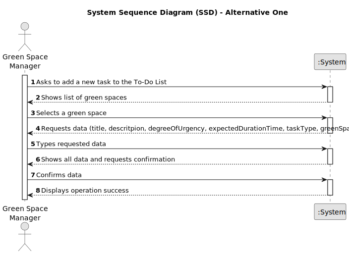

# US021 - Add a new entry to the To-Do List 

## 1. Requirements Engineering

### 1.1. User Story Description

As a Green Space Manager (GSM), I want to add a new entry to the To-Do List

### 1.2. Customer Specifications and Clarifications 

**From the specifications document:**

>	The GSM is tasked with the job of adding new entrys to the To-Do List.
>
>	The new entrys must be associated with green spaces managed by GSM.
>
>   The green spaces for the new entrys should be chosen from a list presented to the GSM.

**From the client clarifications:**

> **Question:** If there are multiple GSM in the system, can a GSM create an entry for a Green Space managed by another GSM?
>
> **Answer:** No.

> **Question:** What are the details the GSM needs to input, other than the Green Space, frequency, estimated duration?Title and description are required?
>
> **Answer:** Title and description could be useful.

> **Question:** Should the to-do entries be unique or can a GSM repeat the same to-do entry, for the same Green Space, multiple times ?
> 
> **Answer:** Yes; Assuming the previous task with same description was previously processed and is not open anymore.

### 1.3. Acceptance Criteria

* **AC1:** The new entry must be associated with a green space managed by the GSM.
* **AC2:** The green space for the new entry should be chosen from a list presented to the GSM.

### 1.4. Found out Dependencies

* There is a dependency on "US022" - to add a new entry in the Agenda, the new entry must exist in the To-Do List.

### 1.5 Input and Output Data

**Input Data:**

* Typed data:
    * Task title
    * Task description
    * Degree of urgency
    * Estimated duration
    * Task Type

	
* Selected data:
    * Green space

**Output Data:**

* List of green spaces managed by the GSM
* Success of the operation
* Error messages

### 1.6. System Sequence Diagram (SSD)

**_Other alternatives might exist._**

#### Alternative One

#### Alternative Two

### 1.7 Other Relevant Remarks

* n/a