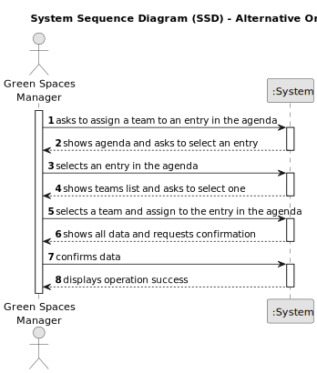
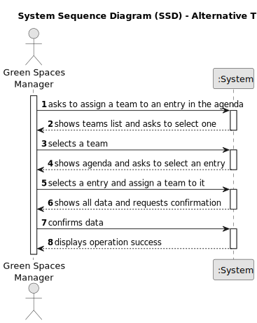

# US023 - Assign a Team to an entry in the Agenda 

## 1. Requirements Engineering

### 1.1. User Story Description

As a GSM, I want to assign a Team to an entry in the Agenda.

### 1.2. Customer Specifications and Clarifications 

**From the specifications document:**

>	The Agenda is also made up of teams that will carry out the tasks.

>	A team will carry out that task in a green space at a certain time interval on a specific date.
 
>   The Green Spaces Manager is responsible for assigning the team to the entry in the Agenda.

**From the client clarifications:**

> **Question:** Can a Team be assigned to multiple entrys?
>
> **Answer:** yes.

> **Question:** Can an Agenda entry have more than one team assigned to it?
>
> **Answer:** No.

### 1.3. Acceptance Criteria

* **AC1:** A message must be sent to all team members informing them about the assignment.
* **AC2:** Different email services can send the message. These services must be defined through a configuration file to allow the use of different platforms (e.g. Gmail, DEI’s email service, etc.).
* **AC3:** A agenda entry can only have one team assigned to it
* **AC4:** GSM will select a team from the list of teams generated in US05.
* **AC5:** GSM will select an entry from those contained in the Agenda.
* **AC6:** System must ensure that only GSM assigns a Team to an agenda entry.

### 1.4. Found out Dependencies

* There is a dependency on "US005 - Generate a team proposal automatically" as there must be at least one team to be able to assign.
* There is a dependency on "US022 - Add a entry in the Agenda" as there must be at least one entry in the agenda.

### 1.5 Input and Output Data

**Input Data:**
	
* Selected data:
    * Team
    * Entry in the Agenda

**Output Data:**

* All team data
* Entry in the Agenda
* (In)Success of the operation

### 1.6. System Sequence Diagram (SSD)

**_Other alternatives might exist._**

#### Alternative One

#### Alternative Two

### 1.7 Other Relevant Remarks

* n/a