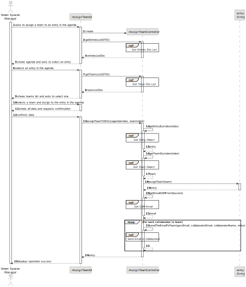
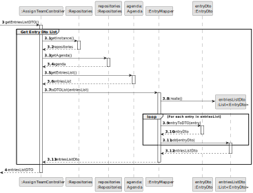
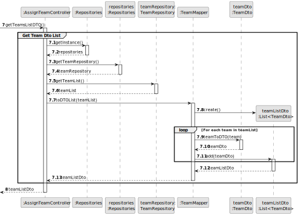
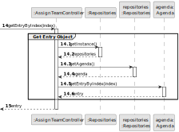
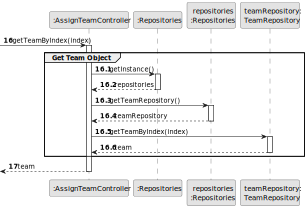
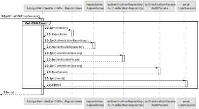
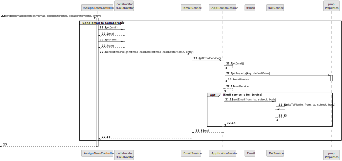
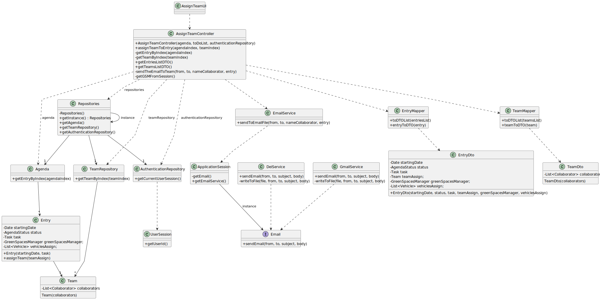

# US023 - Assign a Team to an entry in the Agenda

## 3. Design - User Story Realization 

### 3.1. Rationale

_**Note that SSD - Alternative One is adopted.**_

| Interaction ID | Question: Which class is responsible for...    | Answer                   | Justification (with patterns)                                                                                                    |
|:---------------|:-----------------------------------------------|:-------------------------|:---------------------------------------------------------------------------------------------------------------------------------|
| Step 1  		     | 	... interacting with the actor?               | AssignTeamUI             | Pure Fabrication: there is no reason to assign this responsibility to any existing class in the Domain Model.                    |
| 			  		        | 	... coordinating the US?                      | AssignTeamController     | Controller                                                                                                                       |
| 			  		        | ... knowing the user using the system?         | AuthenticationRepository | Information Expert: cf. A&A component documentation.                                                                             |
| 			  		        | 							                                        | GreenSpaceManager        | IE: knows its own data (e.g. email)                                                                                              |
| Step 2 		      | 	... knowing the agenda to show?               | Agenda                   | Information Expert: owns all entries                                                                                             |
| Step 3 		      | 	... saving the selected entry?                | Entry                    | Information Expert: object created has its own data                                                                              |
| Step 4 		      | 	... knowing the teams to show?                | TeamRepository           | Information Expert: owns all teams                                                                                               |
| Step 5 		      | 	... saving the selected team?                 | Team                     | Information Expert: object created has its own data                                                                              |
| Step 6 		      | 	                                              |                          |                                                                                                                                  |
| Step 7 		      | 	... validating all data (global validation)?  | Agenda                   | Information Expert: knows all entries                                                                                            |
| 		             | 	... validating all data (global validation)?  | TeamRepository           | Information Expert: knows all teams                                                                                              |
| 		             | 	... assign a team to an entry?                | AssignTeamController     | Information Expert: knows what entry it needs to add a team to.                                                                  |
| 		             | ... send the email text to the file            | EmailService             | Creator: Is the most susceptible class to create the email                                                                       |
| 		             | ... select the email service used              | Email                    | Protected Variation and Adapter: Depends on the email service defined in the configuration file                                  |
| 		             | ... send the email text to the respective file | DeiService/GmailService  | Adapter: Depends on the email service defined in the configuration file                                                          | 
| Step 8 		      | 	... informing operation success?              | AssignTeamUI             | Information Expert: is responsible for user interactions.                                                                        |

### Systematization ##

According to the taken rationale, the conceptual classes promoted to software classes are: 

* Entry
* Team
* Agenda
* EmailService
* Email
* DeiService
* GmailService
* Collaborator

Other software classes (i.e. Pure Fabrication) identified: 

* AssignTeamUI  
* AssignTeamController

## 3.2. Sequence Diagram (SD)

_**Note that SSD - Alternative One is adopted.**_

### Full Diagram

This diagram shows the full sequence of interactions between the classes involved in the realization of this user story.

### Split Diagrams

The following diagram shows the same sequence of interactions between the classes involved in the realization of this user story, but it is split in partial diagrams to better illustrate the interactions between the classes.

It uses Interaction Occurrence (a.k.a. Interaction Use).

**Get Entry Dto List**

**Get Team Dto List**

**Get Entry Object**

**Get Team Object**

**Get GSM Email**

**Send Email to Collaborator**

## 3.3. Class Diagram (CD)

