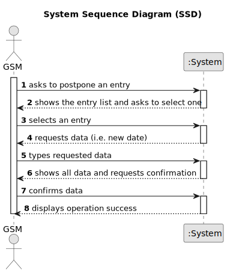

  # US024 - Postpone a Date

## 1. Requirements Engineering

### 1.1. User Story Description

As a GSM, I want to Postpone an entry in the Agenda to a specific future date.

### 1.2. Customer Specifications and Clarifications 

**From the specifications document:**

>   The GSM should be able to select the specific entry in the Agenda that they want to postpone.

>	The GSM should be able to choose a specific future date for the postponed entry.

>   The selected entry in the Agenda should be moved to the specified new date.

**From the client clarifications:**

> **Question:** The date you want to postpone is the date referring to the "approximate expected duration" field when we registered the task?
>
> **Answer:** No; sometimes, for various reasons (e.g. insufficient staff, faulty equipment or adverse weather conditions) a task has to be postponed to a new date; task duration is not directly related to this.

> **Question:** An entry in the Agenda (i.e. a task) can have the status of Planned, Postponed, Canceled or
Done?
>
> **Answer:** 

### 1.3. Acceptance Criteria

* **AC1:** The GSM uses a date picker to choose the new future date for the entry.
* **AC2:** The Agenda is updated, maintaining all relevant information about the task.
* **AC3:** Notifications are automatically sent to the involved team and other stakeholders if this functionality is implemented.

### 1.4. Found out Dependencies

* There is a dependency on "US022 - Add a new entry in the Agenda."

### 1.5 Input and Output Data

**Input Data:**

* Typed data:
    * a new date
	
* Selected data:
    * an existent entry

**Output Data:**

* (In)Success of the operation

### 1.6. System Sequence Diagram (SSD)

#### Alternative One

