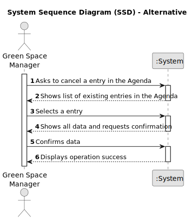

# US025 - Cancel an entry in the Agenda

## 1. Requirements Engineering

### 1.1. User Story Description

As a GSM, I want to Cancel an entry in the Agenda

### 1.2. Customer Specifications and Clarifications 

**From the specifications document:**

>	A task can only be canceled if it is in one of the following states: Planned, Postponed.

>	A task in the "Done" state cannot be cancelled.

**From the client clarifications:**

> **Question:** When a task is cancelled, is it possible to put it back on the agenda again later?
>
> **Answer:** Yes.

> **Question:** When we cancel a task, do we move it again to the To-Do List?
>
> **Answer:** No.

### 1.3. Acceptance Criteria

* **AC1:** A canceled task should not be deleted, but rather change its status to "Cancelled".
* **AC2:** Maintaining the history of task state changes for control and tracking.
* **AC3:** When creating a task with an existing reference, the system must reject such operation and the user must be able to modify the typed reference.

### 1.4. Found out Dependencies

* There is a dependency on "US022 - Add a new entry in the Agenda".

### 1.5 Input and Output Data

**Input Data:**

* Selected data:
    * an existent entry. 

**Output Data:**

* list of existing entries in the system.
* new Agenda status

### 1.6. System Sequence Diagram (SSD)

#### Alternative One

### 1.7 Other Relevant Remarks

* n/a
