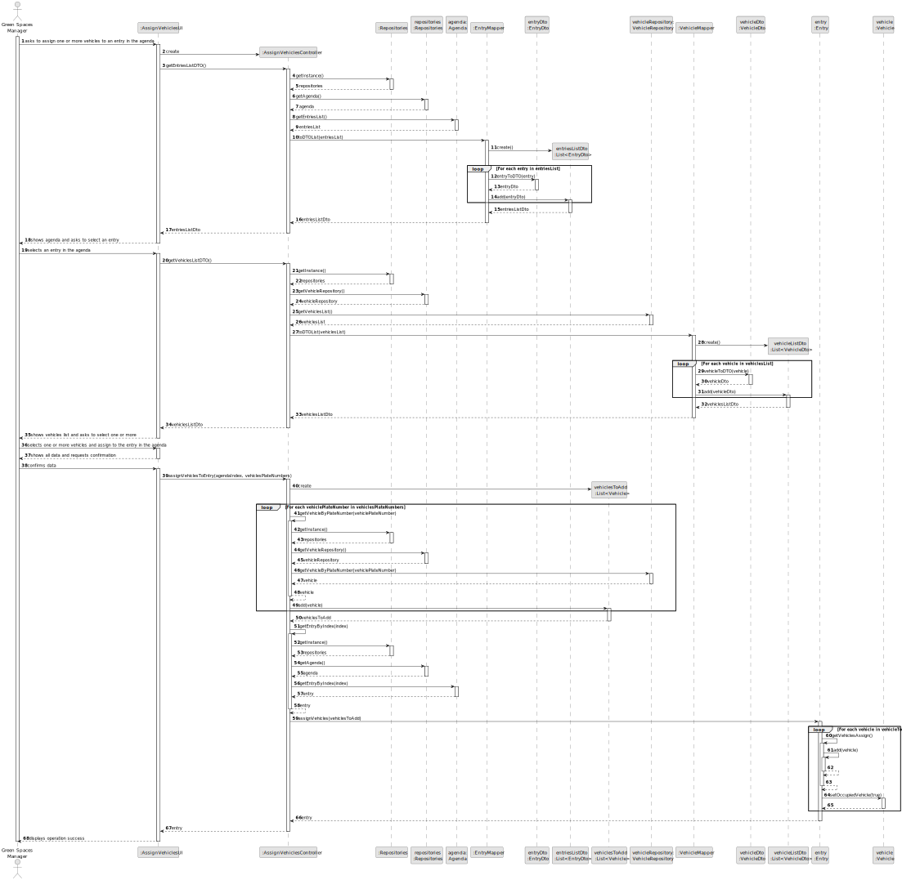
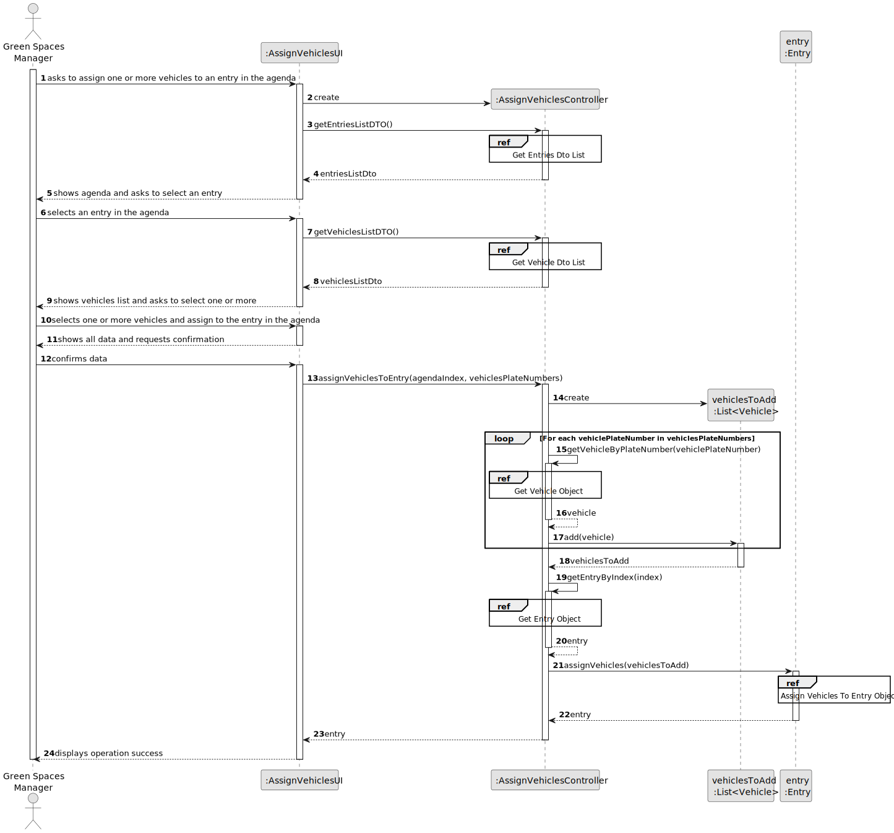

# US026 - Assign Vehicles to an entry in the Agenda

## 3. Design - User Story Realization 

### 3.1. Rationale

_**Note that SSD - Alternative One is adopted.**_

| Interaction ID | Question: Which class is responsible for...    | Answer                   | Justification (with patterns)                                                                                 |
|:---------------|:-----------------------------------------------|:-------------------------|:--------------------------------------------------------------------------------------------------------------|
| Step 1  		     | 	... interacting with the actor?               | AssignVehiclesUI         | Pure Fabrication: there is no reason to assign this responsibility to any existing class in the Domain Model. |
| 			  		        | 	... coordinating the US?                      | AssignVehiclesController | Controller                                                                                                    |
| Step 2 		      | 	... knowing the agenda to show?               | Agenda                   | Information Expert: owns all entries                                                                          |
| Step 3 		      | 	... saving the selected entry?                | Entry                    | Information Expert: object created has its own data                                                           |
| Step 4 		      | 	... knowing the vehicles to show?             | VehicleRepository        | Information Expert: owns all vehicles                                                                         |
| Step 5 		      | 	... saving the selected vehicles?             | Vehicle                  | Information Expert: object created has its own data                                                           |
| Step 6 		      | 	                                              |                          |                                                                                                               |
| Step 7 		      | 	... validating all data (global validation)?  | VehicleRepository        | Information Expert: knows all vehicles                                                                        |
| 		             | 	... validating all data (global validation)?  | Agenda                   | Information Expert: knows all entries                                                                         |
| 		             | 	... assign vehicles to an entry?                | AssignVehiclesController     | Information Expert: knows what entry it needs to add the vehicles to.                                           |
| Step 8 		      | 	... informing operation success?              | AssignTeamUI             | Information Expert: is responsible for user interactions.                                                     |

### Systematization ##

According to the taken rationale, the conceptual classes promoted to software classes are: 

* Entry
* Vehicle
* Agenda

Other software classes (i.e. Pure Fabrication) identified: 

* AssignVehiclesUI  
* AssignVehiclesController

## 3.2. Sequence Diagram (SD)

_**Note that SSD - Alternative One is adopted.**_

### Full Diagram

This diagram shows the full sequence of interactions between the classes involved in the realization of this user story.

### Split Diagrams

The following diagram shows the same sequence of interactions between the classes involved in the realization of this user story, but it is split in partial diagrams to better illustrate the interactions between the classes.

It uses Interaction Occurrence (a.k.a. Interaction Use).

**Get Entries Dto List**

**Get Vehicles Dto List**

**Get Entry Object**

**Get Vehicle Object**

**Assign Vehicles to Entry Object**

## 3.3. Class Diagram (CD)

