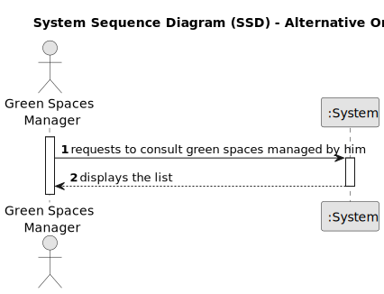

# US027 - List of Green Spaces managed by me

## 1. Requirements Engineering

### 1.1. User Story Description

As a GSM, I need to list all green spaces managed by me.

### 1.2. Customer Specifications and Clarifications 

**From the specifications document:**

>	There must be two algorithms to sort the list of green spaces

**From the client clarifications:**

> **Question:** Which info about Green Spaces do you want the GSM see when listing? Only the name?
>
> **Answer:** Each de team can decide about the aspects related to UX/UI.

> **Question:** The GSM should be register in the app previously? Which attributes should it have?
>
> **Answer:** Yes, the app can have multiple GSM registered (for instance that can be done during usgin the boostrap). A collaborator is a person (an employee) that have a name, birthdate, a salary, etc.

> **Question:** A  GSM is a collaborator?
>
> **Answer:** A GSM is a role played by a collaborator. Depending in the size of the company, you can have a collaborator playing multiple roles like GSM, VFM or HRM or different persons playing the same role like GSM.

### 1.3. Acceptance Criteria

* **AC1:** The list of green spaces must be sorted by size in descending
  order (area in hectares should be used). The sorting algorithm to
  be used by the application must be defined through a configuration
  file. At least two sorting algorithms should be available.

### 1.4. Found out Dependencies

* There is a dependency on "US020 - Register a Green Space", as there must be at least one green space to be able to consult. 

### 1.5 Input and Output Data

**Output Data:**

* All data of the new List of Green Spaces managed by me
* (In)Success of the operation

### 1.6. System Sequence Diagram (SSD)

**_Other alternatives might exist._**

### 1.7 Other Relevant Remarks

* n/a