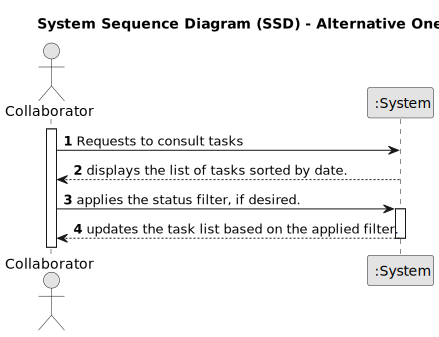

# US028 - Consult the Task Between Two Dates

## 1. Requirements Engineering

### 1.1. User Story Description

As a Collaborator, I wish to consult the tasks assigned to me
between two dates.

### 1.2. Customer Specifications and Clarifications 

**From the specifications document:**

>	The system must allow the collaborator to select a date range to query the tasks assigned to them.

>	The listed tasks must be displayed in ascending chronological order.
   
**From the client clarifications:**

> **Question:** Could a task belong to different teams and collaborators? I mean, if the status, degree of urgency and expect duration belong to an entry of the to do list and the task is something generic that can be reuse, or if the task could belong only to one collaborator, and for another you have to create another one.

> **Answer:** No.
Maybe a distintion should be made between type of task and a task.
Task type is "Prunning trees", a specific task is "Prunning trees" in specific park in a specific date.

> **Question:**  A collaborator could have assigned at the same time different tasks from different teams, isnt it?
Apart, which atributes has a task ( maybe something like: name, frequency, creation_date, lenght, status)? Which id do you want (I think name is not a good idea)? Which status could a task have?

> **Answer:** No, in a specific period (for instance during a week) a collaborator just belongs to team. But if you consider a wider period you may find different teams to which a collaborator belonged.
In this project no distinction will be made between recorrent/occasional tasks; I suppose that the identification is a combination of Name, Date and Local, like Prunning Trees at 20/05/2024 in Parque da Cidade.

### 1.3. Acceptance Criteria

* **AC1:** The list of green spaces must be sorted by date
* **AC2:** The Collaborator should be able to filter the results by the
  status of the task.

### 1.4. Found out Dependencies

* There is a dependency on "US022 - Add a new entry in the Agenda" because in order to display the list of tasks, we must know which ones exist
### 1.5 Input and Output Data
	
* Selected data:
    * Two date selection fields (start date and end date).

**Output Data:**

*  List displaying the tasks sorted by date with relevant information (task name, description, status, location).

### 1.6. System Sequence Diagram (SSD)

**_Other alternatives might exist._**

#### Alternative One

