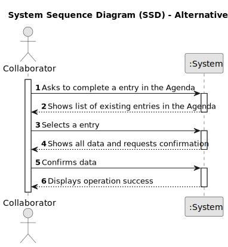

# US029 - Record the completion of a task 

## 1. Requirements Engineering

### 1.1. User Story Description

- As a Collaborator, I want to record the completion of a task.

### 1.2. Customer Specifications and Clarifications 

**From the specifications document:**

> A task can only be recorded as "Done" if it is "Planned".

**From the client clarifications:**

> **Question:** Can a collaborator mark a task as "done" only if it is in the "planned" status?
>
> **Answer:** Yes, just the "Planned" status can be changed to "Done".

> **Question:** The collaborator should be able to change the status of any task or only tasks assigned to him?
>
> **Answer:** Only the tasks assigned to him.

### 1.3. Acceptance Criteria
* **AC1:** Only "Planned" tasks can be changed to "Done".
* **AC2:** A collaborator can only change the status of a task to "Done" if it is assigned to him.

### 1.4. Found out Dependencies

* There is a dependency on "US022 - Add a new entry in the Agenda".

### 1.5 Input and Output Data

**Input Data:**

* Selected data:
    * an existing entry 

**Output Data:**

* list of existing entries in the system. 
* new Agenda status

### 1.6. System Sequence Diagram (SSD)

**_Other alternatives might exist._**

#### Alternative One

### 1.7 Other Relevant Remarks

* n/a